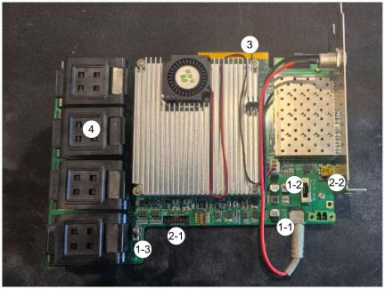
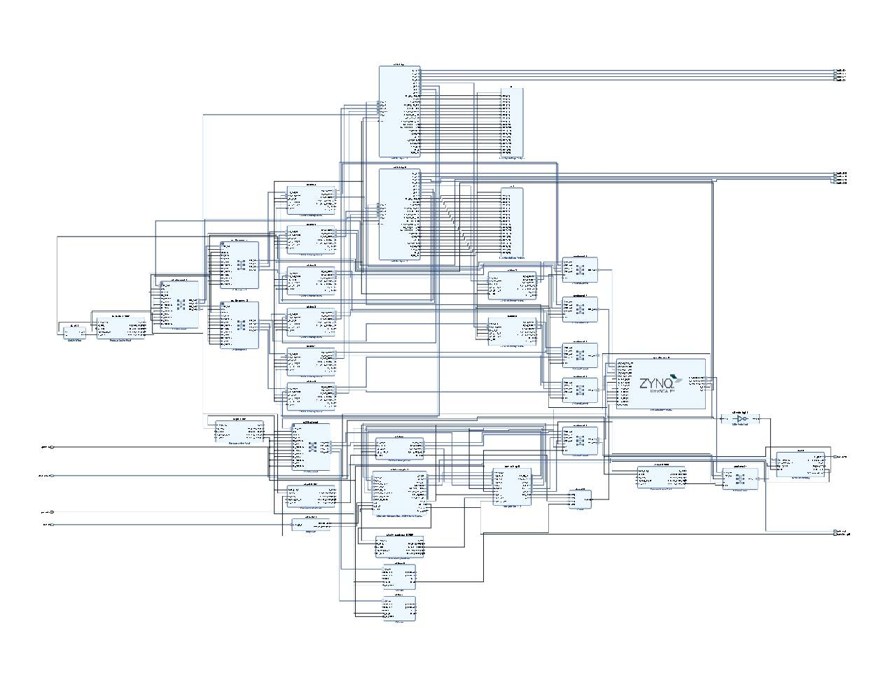

# SoftSSD-Platform

## Overview

### Feature

* Our SSD development platform is built around the **Xilinx Zynq® UltraScale+™ MPSoC** as the core board. 
* This device features a heterogeneous computing architecture, integrating programmable **ARM Cortex® application processors** with a high-performance **FPGA fabric** on a single chip.
   * This combination enables flexible and efficient execution of both control-plane tasks (on the ARM cores) and data-plane acceleration (in the FPGA logic).

### Price: 25,000 HKD

### For inquiries about this platform and to request access to the prototype, please contact:

* Email: kchuang21@cse.cuhk.edu.hk

### The details for platform deployment can be found at: 

* [deployment Notes](/Guide/Notes.md).
* 
* [A Step-by-step Guide](/Guide/SoftSSD_Setup_Guide.pdf).

## Hardware Architecture

The core board is mounted onto a custom carrier (or base) board, which provides essential system-level support, including:

1. Power delivery and regulation (1-1 12V DC power, 1-2 On/Off control, 1-3 Voltage control),
2. Debug interfaces (2-1 JTAG, 2-2 UART),
3. A PCIe interface for host connectivity (3), and
4. NAND flash interfaces to connect multiple flash packages (4).

### APU and RPU

* ARM application processors: High-performance ARM cores (quad-core Cortex-A53) to handle application-level tasks.
* Co-processors: Auxiliary processing units, Cortex-R5 real-time cores (used for real-time control, safety-critical tasks, or low-latency I/O), that assist the main application processors. 

The SSD firmware runs on the ARM application processors, while flash translation and ECC offload are handled by dedicated co-processors.

### FPGA 

The FPGA implements a NVMe-over-PCIe controller and ONFI-compliant NAND flash controllers. These controllers are connected with both on-board DDR memory and the ARM processor’s memory hierarchy, enabling efficient data movement across the heterogeneous compute fabric.

* The NVMe-PCIe controller handles host communication via the PCIe interface, managing Submission and Completion Queues and performing DMA operations.

* The ONFI flash controller manages low-level NAND operations, including read, program, and erase commands, timing control, and interface protocol compliance. Each flash controller corresponds to one flash memory channel, and the system currently supports up to eight channels.

### Memory Regions

The SSD board has three physical memroy regions: 
* PL DDR (4GB): Data cache
* PS DDR Low (2GB): L2P mapping cache and Flash transaction buffer
* PS DDR High (2GB): L2P mapping cache

### Flash Memory
Pins on the FPGA have been assigned for the flash chip interface, supporting up to 8 channels. Regarding interface protocols, NV-DDR2 is currently stably supported, while NV-DDR3 is supported experimentally. The board is shipped with the following flash chips:
* MLC NAND chip: *MT29F1T08CUCCB* (2 channels per package)
* TLC NAND chip: *MT29F512G08EBHBF* (1 channel per package)
In theory, other flash chips with compatible interface protocols can be substituted, provided that pin assignments are correctly configured accordingly.

The performance of pages at different locations within TLC NAND flash varies significantly. To provide a reference, internal bandwidth measurements for the SSD platform employing TLC chips (MT29F512G08EBHBF) are summarized in the table below:
|Page latecncy|Lower-page|Upper-page|Extra-page|*avg.*|
|---|---|---|---|---|
|read|115us|130us|145us|130us|
|program|600us|60us|1460us|706us|

|Internal bandwidth|Per-channel (single die)|Overall|
|---|---|---|
|read|120MB/s|480MB/s|
|program|20MB/s|80MB/s|

The FPGA operates at a frequency of 200 MHz and is configured to match the timing mode 7 of NV-DDR2/3. Each channel employs an 8-bit wide differential signaling interface, transferring data on both the rising and falling edges of the clock. Consequently, the theoretical bandwidth per channel is 400 MB/s.

All dies within a channel time-share the channel’s bandwidth. By increasing the number of LUNs (dies) per channel and leveraging interleaved die access (multi-LUN) along with multi-plane read/write operations, the effective bandwidth can approach this theoretical limit.

Under ideal conditions, with all eight channels operating simultaneously, the aggregate bandwidth ceiling reaches 3.2 GB/s.

# Development Notes of SoftSSD

## Setup
### Firmware Preparation
1. Install AMD Xilinx Vitis and Vivado Tools.
2. Download the source code.
3. Create a Vivado project and generate the bitstream, or use a pre-generated bitstream file.
4. Initialize the Vitis project (according to the content of the README).
5. Compile the Vitis project to generate the firmware.
### Hardware Bootup
1. Prepare two host machines: 

&emsp;&emsp; *one serves as the **host PC** for downloading firmware to and monitoring the output from the target board, and the other as the **test machine**.*
1. Install flash chips.
2. (Optional) Configure the flash parameters.
3. Adjust the power switch. 
4. Connect the board to the **host PC**
5. Insert the board into the **test machine's** PCIe slot.
6. Boot the board by downloading and launching the firmware.
7. Boot the **test machine's**
8. The storage device can be observed using *lspci* or *lsblk*.

## Software modules

### Host Interface Layer [*code@nvme_ftl/src/hostif*]
* #### Initilization Stage
The host identifies the SSD by performing read and write operations on its doorbell registers. It then sets up the Admin Submission Queue (ASQ) and Admin Completion Queue (ACQ) pair, notifying the SSD of the queue configuration via the corresponding doorbell registers. Subsequently, additional I/O Submission and Completion Queue (SQ/CQ) pairs are established by issuing queue creation commands through the admin queue pair. Once all required SQ/CQ pairs are properly initialized, the SSD is ready to process NVMe I/O requests.
* #### Request-Response
The host places NVMe commands into the Submission Queue (SQ) and then updates the SQ tail pointer by writing to the corresponding doorbell register. The SSD subsequently fetches the commands and any associated data via PCIe DMA. Once the request has been processed, the SSD, if required, writes the resulting data to the host-provided buffer and, posts a completion entry to the Completion Queue (CQ).

### Flash Translation Layer [*code@nvme_ftl/src/ftl*]
* #### Data Cache [512MB]
The data cache employs a **No Read Allocate** policy for read misses and a **Write Allocate** policy combined with **Write-Back** for writes.
The cache block size is 16 KB, aligned with the flash page size, whereas NVMe I/O requests operate on units of 4 KB (the logical sector size), with each request typically spanning one or more such sectors.

Consequently, when the data cache flushes a dirty cache block, it must consult the Logical-to-Physical (L2P) mapping table to identify which 4 KB sectors within the 16 KB page are valid. If only a subset of sectors is being updated, a **Read-Modify-Write** operation is performed to preserve the integrity of the unchanged sectors.
* #### On-demand FTL [1GB]
The L2P (Logical-to-Physical) mapping table is stored in flash memory and loaded into DRAM on demand. Each 16 KB translation page contains 4K physical page addresses (PPAs). The physical addresses of these translation pages themselves are stored in the **Global Translation Directory (GTD)**.

Initially, the in-memory mapping table cache is empty. Translation pages are fetched into memory only when needed and are updated **out-of-place**: when modified, dirty pages are written back to new flash locations using a **write-back policy**, and the updated physical addresses are recorded in the GTD.
* #### Block Manager
Physical page allocation and management are controlled by the block manager. Each flash plane maintains one open block, from which physical pages are allocated for logical pages mapped to that plane. The corresponding **invalid page bitmap** is updated atomically during page allocation. When the open block is exhausted, a new block is opened on the same plane.

The current garbage collection (GC) policy is **intra-plane, online, and blocking**. Specifically, when the block manager attempts to open a new block and finds insufficient free blocks available on the plane, it triggers an intra-plane GC operation. During this GC process, all other read and write requests directed to that plane are blocked until GC completes.

### Flash Interface Layer [*code@nvme_fil/src/fil*]
The Flash Interface Layer is responsible for handling data read, write, and erase operations on the flash chips. It first enqueues flash transactions into a per-chip pending queue and processes requests from each chip in a round-robin polling manner. Flash commands are issued through the ONFI controller.
* #### ONFI controller
The ONFI standard defines electrical interfaces, signaling protocols, and command sets to ensure interoperability among NAND flash chips from different manufacturers. Our ONFI flash controllers are implemented in FPGA, and currently support **Asynchronous**, **NVDDR2**, and **NVDDR3** interfaces. The Asynchronous and NVDDR2 interfaces operate at 1.8 V, while the NVDDR3 interface operates at 1.2 V. When powered up at 1.8 V, the flash chip defaults to Asynchronous mode. The controller then issues a SET FEATURES command to switch the flash chip to NVDDR2 mode.
When powered up at 1.2 V, the NVDDR3 interface is activated directly upon initialization.

### ECC Engine[*code@nvme_ecc/src*]
Both ECC encoding and decoding are now fully integrated into the flash controller hardware. Once the controller is properly configured, it automatically performs ECC operations on all data during read and write transactions—without requiring software intervention. The ECC parity bits are stored alongside the user data in the **out-of-band (OOB)** area of each flash page.

However, when ECC decoding detects an uncorrectable error (or in some implementations, even a correctable multi-bit error), explicit **error handling** is required, and the correction procedure is handled by the code in ECC engine.

### Metadata Persistence and Recovery
After data is written to flash memory, certain metadata structures in the SSD’s internal memory are generated or updated. These metadata must be persisted to non-volatile storage to ensure consistency and durability.
When the host issues an fsync request, the SSD performs the following operations in sequence:

1. Flushes dirty data pages from the data cache to flash;
2. Writes back dirty translation pages from the L2P mapping cache;
3. Persists the Global Translation Directory (GTD);
4. Saves the per-plane block allocation state (e.g., open block information and free block bitmap).

Upon system shutdown, the host sends a Shutdown Notification (as defined in the NVMe specification) to the SSD. In response, the SSD executes the same fsync-like persistence sequence to safely commit all in-memory metadata to flash before power is removed.

**Important**: The SSD board does not include power-loss protection capacitors. An unexpected power loss will result in data corruption or metadata inconsistency, as in-flight writes and unflushed metadata cannot be recovered.

### Request Processing Flow
NVMe requests residing in the Submission Queue (SQ) are fetched by the SSD into its internal memory via PCIe DMA. Each request is then split into 16 KB-aligned sub-requests, which are processed sequentially. Upon completion of all sub-requests, a completion entry is posted to the Completion Queue (CQ).

For each sub-request, the SSD first checks the data cache:

* If there is a cache hit, the sub-request is completed immediately.
* On a cache miss, the data cache initiates a miss handling procedure, which may involve:
    * Writing back dirty data (if the evicted cache line is dirty), and
    * Loading the required data from flash.

During both data write-back and data loading, the SSD consults the L2P mapping cache to translate logical addresses to physical flash locations:
* If the L2P mapping is not present (miss), the corresponding translation page is loaded on demand from flash into the L2P cache.

Notably, data write-back requires allocation of a new flash page (due to the out-of-place update nature of NAND flash).

All flash read and write operations—for both data pages and translation pages—are performed by submitting requests to a dedicated request queue of an ARM core that runs the Flash Interface Layer. Completed flash operations are returned via a completion queue associated with that core.

### Coroutine Scheduling
Our SSD platform employs a multi-tasking concurrency model to process multiple NVMe requests simultaneously. Each task handles a single NVMe request, and tasks share critical resources using locks, semaphores, and other synchronization primitives.

Underlying this model is a lightweight coroutine framework. The main program initializes 16 task coroutines at startup. During the execution gaps between coroutine yields, the scheduler polls various queues—such as the NVMe Submission Queues (SQs) and flash request completion queues—and resumes the appropriate coroutines when their awaited events or data become available.

