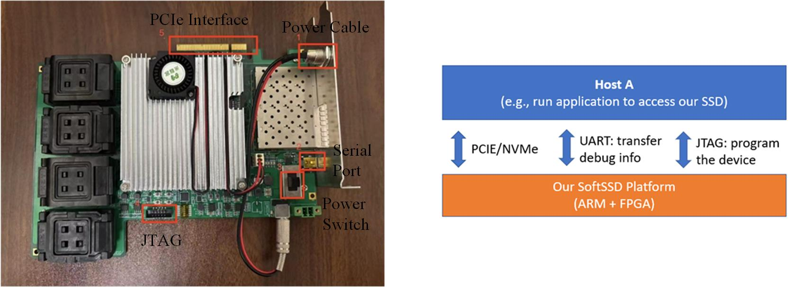

# SoftSSD-Platform

## Overview

### SoftSSD Highlights

* Complete flash firmware atop multi-core processors, including a Flash Translation Layer (FTL), Flash Interface Layer (FIL), and Error Correction Code (ECC) engine. 
  * FTL: Coroutine-based Address mapping & storage management (e.g., GC); automatic task switching, with enhanced concurrency, system responsiveness, and throughput.
  * FIL: Queue-based low-level flash transactions; efficient data communication.
  * ECC: Ensures data integrity through error detection and correction.

* Software-hardware acceleration design
  * PCIe Interface, with FPGA-based physical layer & data link layer implementation.
  * DMA Interface, with offloaded Transaction Layer Packet (TLP) processing for improved performance.
  * Coding/Decoding, with interleaved storage of data blocks and code bits.

 ### Device Features

* Our platform features a heterogeneous computing architecture, integrating programmable **ARM Cortex® application processors** with a high-performance **FPGA fabric** on a single chip.
   * Our SSD development platform is built around the **Xilinx Zynq® UltraScale+™ MPSoC** as the core board. 
   * This combination enables flexible and efficient execution of both control-plane tasks (on the ARM cores) and data-plane acceleration (in the FPGA logic).
 
  
* More features can be found in [Introduction to SoftSSD](/Guide/Intro.md).

### Price: 32,000 HKD

### For inquiries about this platform and to request access to the prototype, please contact:

* Email: softssd26@gmail.com

### The details for platform deployment can be found at: 

* [Development Notes](/Guide/Notes.md).

* [A Step-by-step Guide](/Guide/SoftSSD_Setup_Guide.pdf).

###  Reference Paper:
* [SoftSSD Paper](https://link.springer.com/article/10.1631/fitee.2200456)

